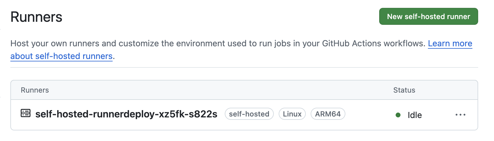

# Python App

> Example Python App for use with the [From DevOps to Platform Engineering: Master Backstage & IDPs](https://www.udemy.com/course/from-devops-to-platform-engineering-master-backstage-idps/) course created by [Ricardo Andre Gonzalez Gomez](https://www.udemy.com/user/ricardo-andre-gonzalez-gomez/) on Udemy.

## Setup

You'll need Devbox installed, and the ideal IDE is Visual Studio Code.

### Install the Python dependencies

```shell
% devbox shell
% pip install -r requirements.txt
```

## Running in development mode

```shell
% flask --app app.py --debug run
 * Serving Flask app 'app.py'
 * Debug mode: on
WARNING: This is a development server. Do not use it in a production deployment. Use a production WSGI server instead.
 * Running on http://127.0.0.1:5000
 ```

## Running Locally in Docker

> Note: You'll need Docker Desktop locally.

### Building the image

```shell
% docker build -t python-app:v2 .
```

### Running the image in Docker

```shell
% docker run -p 8080:5000 python-app:v2
```

### Tag and push image to Docker Hub

> Note: You'll need to have a Docker Hub account and to have you local environment set up to authenticare with Docker Hub using an access token.

```shell
% docker tag python-app:v2 loickreitmann/python-app:v2
% docker push loickreitmann/python-app:v2
```

## Running Locally Kubernetes

> Note: You'll need Rancher Desktop running locally.

### Apply the K8s configurations to run in Kubernetes

```shell
% kubectl apply -f k8s/deploy.yaml
% kubectl apply -f k8s/service.yaml
% kubectl apply -f k8s/ingresss.yaml
```

### Take a look a how things running

```shell
% kubectl describe svc python-app
Name:                     python-app
Namespace:                default
Labels:                   <none>
Annotations:              <none>
Selector:                 app=python-app
Type:                     ClusterIP
IP Family Policy:         SingleStack
IP Families:              IPv4
IP:                       10.43.47.207
IPs:                      10.43.47.207
Port:                     <unset>  8080/TCP
TargetPort:               5000/TCP
Endpoints:                10.42.0.239:5000
Session Affinity:         None
Internal Traffic Policy:  Cluster
Events:                   <none>
```

```shell
% kubectl get ing
NAME         CLASS     HOSTS              ADDRESS      PORTS   AGE
python-app   traefik   python-app.local   10.0.0.206   80      5m23s
```

### Deleting the deployments

```shell
% kubectl delete -f k8s
deployment.apps "python-app" deleted
ingress.networking.k8s.io "python-app" deleted
service "python-app" deleted
```

## Using Helm to Manage Deployment Configuration

Created the charts directory and created our helm app.

```shell
% mkdir charts
% cd charts
% helm create python-app
```

### Install the helm chart on kubernetes

```shell
% cd charts/python-app
% helm install python-app -n python-app . --create-namespace
NAME: python-app
LAST DEPLOYED: Sun Apr  6 14:04:28 2025
NAMESPACE: python-app
STATUS: deployed
REVISION: 1
TEST SUITE: None
NOTES:
1. Get the application URL by running these commands:
  http://python-app.local/
```

### Delete the python-app from kubernetes with Helm

```shell
% helm uninstall python-app -n python-app
```

## GitOps: Using Argo CD

### Add the Argo CD Repo to Helm

```shell
% helm repo add argo https://argoproj.github.io/argo-helm
"argo" has been added to your repositories

% helm repo ls
NAME    URL
argo    https://argoproj.github.io/argo-helm
```

### Install Argo CD with Helm

From the project's root, run the following:

```shell
% cd charts/argocd
% helm upgrade --install argocd argo/argo-cd -n argocd --create-namespace -f values-argo.yaml
Release "argocd" does not exist. Installing it now.
NAME: argocd
LAST DEPLOYED: Sun Apr 13 17:11:26 2025
NAMESPACE: argocd
STATUS: deployed
REVISION: 1
TEST SUITE: None
NOTES:
In order to access the server UI you have the following options:

1. kubectl port-forward service/argocd-server -n argocd 8080:443

    and then open the browser on http://localhost:8080 and accept the certificate

2. enable ingress in the values file `server.ingress.enabled` and either
      - Add the annotation for ssl passthrough: https://argo-cd.readthedocs.io/en/stable/operator-manual/ingress/#option-1-ssl-passthrough
      - Set the `configs.params."server.insecure"` in the values file and terminate SSL at your ingress: https://argo-cd.readthedocs.io/en/stable/operator-manual/ingress/#option-2-multiple-ingress-objects-and-hosts


After reaching the UI the first time you can login with username: admin and the random password generated during the installation. You can find the password by running:

kubectl -n argocd get secret argocd-initial-admin-secret -o jsonpath="{.data.password}" | base64 -d

(You should delete the initial secret afterwards as suggested by the Getting Started Guide: https://argo-cd.readthedocs.io/en/stable/getting_started/#4-login-using-the-cli)
```

### Install the Ingresses for Accessing Argo CD

#### Web UI Ingress

From the project's root, run the following:

```shell
% cd argocd/
% kubectl apply -f argocd-ingress.yaml
```

#### API Ingress to access it using the `argocd` CLI

From the project's root, run the following:

```shell
% cd argocd/
% kubectl apply -f argocd-grpc-ingress.yaml
```

To use the `argocd` CLI, run the login script from within the `argocd/` directory. This script exposes the Argo CD API with port forwarding, since this local setup doesn't use TLS.

```shell
% sh argocd-local-login.sh
🔁 Starting port-forward to Argo CD server...
⏳ Waiting for port 8080 to be available...
Connection to localhost port 8080 [tcp/http-alt] succeeded!
Connection to localhost port 8080 [tcp/http-alt] succeeded!
✅ Port-forward established.
🔐 Getting Argo CD admin password...
🔑 Logging in to Argo CD CLI at localhost:8080...
WARNING: server is not configured with TLS. Proceed (y/n)?
```

Enter `y` at the above prompt.

```shell
WARNING: server is not configured with TLS. Proceed (y/n)? y
'admin:login' logged in successfully
Context 'localhost:8080' updated
🎉 Logged in to Argo CD CLI!
🛑 Killing port-forward (PID xxxx)
argocd-local-login.sh: line 1: kill: (xxxx) - No such process
```

You'll now be able to run `argocd` command in your terminal.

```shell
% argocd proj list
NAME     DESCRIPTION  DESTINATIONS  SOURCES  CLUSTER-RESOURCE-WHITELIST  NAMESPACE-RESOURCE-BLACKLIST  SIGNATURE-KEYS  ORPHANED-RESOURCES  DESTINATION-SERVICE-ACCOUNTS
default               *,*           *        */*                         <none>                        <none>          disabled            <none>
```

```shell
% argocd version
argocd: v2.14.7
  BuildDate: unknown
  GitCommit: v2.14.7
  GitTreeState: clean
  GitTag: v2.14.7
  GoVersion: go1.24.1
  Compiler: gc
  Platform: darwin/arm64
argocd-server: v2.14.9+38985bd
  BuildDate: 2025-04-02T19:31:28Z
  GitCommit: 38985bdcd6c3b031fb83757a1fb0c39a55bf6a24
  GitTreeState: clean
  GoVersion: go1.23.3
  Compiler: gc
  Platform: linux/arm64
  Kustomize Version: v5.4.3 2024-07-19T16:40:33Z
  Helm Version: v3.16.3+gcfd0749
  Kubectl Version: v0.31.0
  Jsonnet Version: v0.20.0
```

```shell
% argocd app list
NAME               CLUSTER                         NAMESPACE   PROJECT  STATUS  HEALTH   SYNCPOLICY  CONDITIONS  REPO                                             PATH               TARGET
argocd/python-app  https://kubernetes.default.svc  python-app  default  Synced  Healthy  Auto        <none>      https://github.com/loickreitmann/python-app.git  charts/python-app  HEAD
```
<!-- #### Create a TLS secret

```shell
% openssl req -x509 -nodes -days 365 -newkey rsa:2048 \
  -keyout tls.key -out tls.crt \
  -subj "/CN=argocd-server.local/O=ArgoCD"
Generating a 2048 bit RSA private key
.....+++++
....................................................+++++
writing new private key to 'tls.key'
-----
```

```shell
% kubectl create secret tls argocd-server-tls \
  --cert=tls.crt --key=tls.key \
  -n argocd
secret/argocd-server-tls created
``` -->

## Continuous Deployment with GitHub Actions Self-Hosted Runners

Using an **Actions Runner Controller** (**ARC**) makes it simpler to run self hosted environments on Kubernetes(K8s) cluster.

With ARC you can :

- Deploy self hosted runners on Kubernetes cluster with a simple set of commands.
- Auto scale runners based on demand.
- Setup across GitHub editions including GitHub Enterprise editions and GitHub Enterprise Cloud.

### Prerequisites

We'll use Helm to prepare the installation.

#### Add the JetStack repo

```shell
% helm repo add jetstack https://charts.jetstack.io --force-update
"jetstack" has been added to your repositories
```

#### Install `cert-manager`

```shell
% helm install \
  cert-manager jetstack/cert-manager \
  --namespace cert-manager \
  --create-namespace \
  --version v1.17.0 \
  --set crds.enabled=true
NAME: cert-manager
LAST DEPLOYED: Sat Apr 12 14:08:13 2025
NAMESPACE: cert-manager
STATUS: deployed
REVISION: 1
TEST SUITE: None
NOTES:
cert-manager v1.17.0 has been deployed successfully!
```

### Deploy and Configure ARC

#### Generate a Personal Access Token (PAT) for ARC to authenticate with GitHub

1. Login to your GitHub account and Navigate to "Create new Token."
2. Select repo.
3. Click Generate Token and then copy the token locally ( we’ll need it later).
4. Make a copy the `.env.sample` named `.env`, and past your new token as the value of the `GH_RUNNER_PAT` local environment variable.

#### Add the repository

```shell
% helm repo add actions-runner-controller https://actions-runner-controller.github.io/actions-runner-controller
"actions-runner-controller" has been added to your repositories
```

#### Install Helm chart

```shell
% helm upgrade --install --namespace actions-runner-system --create-namespace\
  --set=authSecret.create=true\
  --set=authSecret.github_token="$GH_RUNNER_PAT"\
  --wait actions-runner-controller actions-runner-controller/actions-runner-controller
Release "actions-runner-controller" does not exist. Installing it now.
NAME: actions-runner-controller
LAST DEPLOYED: Sat Apr 12 14:45:04 2025
NAMESPACE: actions-runner-system
STATUS: deployed
REVISION: 1
TEST SUITE: None
NOTES:
1. Get the application URL by running these commands:
  export POD_NAME=$(kubectl get pods --namespace actions-runner-system -l "app.kubernetes.io/name=actions-runner-controller,app.kubernetes.io/instance=actions-runner-controller" -o jsonpath="{.items[0].metadata.name}")
  export CONTAINER_PORT=$(kubectl get pod --namespace actions-runner-system $POD_NAME -o jsonpath="{.spec.containers[0].ports[0].containerPort}")
  echo "Visit http://127.0.0.1:8080 to use your application"
  kubectl --namespace actions-runner-system port-forward $POD_NAME 8080:$CONTAINER_PORT
```

This will create the `actions-runner-system` namespace. In the next step, we will deploy our runner to that same `actions-runner-system` namespace.

#### Create the GitHub self hosted runners and configure to run against your repository

Create a `runnerdeployment.yaml` file:

```yaml
apiVersion: actions.summerwind.dev/v1alpha1
kind: RunnerDeployment
metadata:
  name: self-hosted-runnerdeploy
spec:
  replicas: 1
  template:
    spec:
      repository: loickreitmann/python-app
```

Apply it with `kubectl` into your cluster within the `actions-runner-system` namespace.

```shell
% kubectl apply -n actions-runner-system -f github/runnerdeployment.yaml
runnerdeployment.actions.summerwind.dev/self-hosted-runnerdeploy created
```

Success!!


---

## Continuous Deployment with Argo CD from Github Action

### Get the Argo CD `admin` Password

```shell
% kubectl -n argocd get secret argocd-initial-admin-secret -o jsonpath="{.data.password}" | base64 -d && echo
```

Save the resulting output as the `ARGOCD_ADMIN_PASSWORD` variable in your `.env` file.

### Log Into Argo CD with the `argocd` CLI

```shell
% argocd login argocd-server.local --insecure --grpc-web --skip-test-tls --grpc-web-root-path "argocd" --username admin --password '$ARGOCD_ADMIN_PASSWORD'
```
